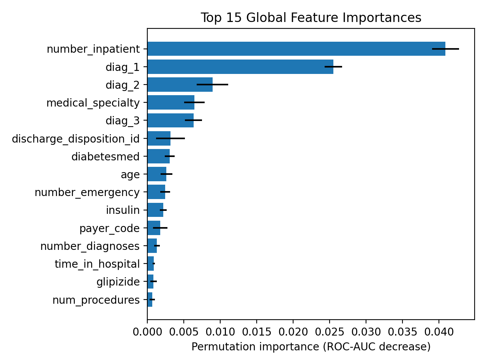

# 🏥 Healthcare Readmission Risk Prediction

An **end-to-end healthcare risk prediction system** that predicts the likelihood of **30-day hospital readmission** using structured clinical data.

This project demonstrates:
- Production-style ML pipelines
- Feature engineering & model training
- **Fairness evaluation across demographic groups**
- **Model explainability for clinical interpretability**

> ⚠️ This project is for **educational and analytical purposes only** and is **not intended for clinical decision-making**.

---

## 🎯 Problem Statement

Hospital readmissions within 30 days are costly and often preventable.  
Accurately identifying **high-risk patients** can help healthcare providers:
- Improve patient outcomes
- Optimize resource allocation
- Reduce avoidable readmissions

This project formulates the problem as a **binary classification task**:
> Predict whether a patient will be readmitted within 30 days.

---

## 📊 Dataset

- **Source:** Diabetes 130-US Hospitals Readmission Dataset (public)
- **Size:** ~101,000 patient encounters
- **Features:** Demographics, diagnoses, procedures, medications, lab tests
- **Target:**  
  `1` → Readmitted within 30 days  
  `0` → Not readmitted within 30 days

⚠️ The dataset is **not included** in this repository.  
See `data/README.md` for download instructions.

---

## 🏗️ Project Architecture
```text
healthcare-risk-prediction/
│
├── src/
│ ├── data/ # Data loading & splitting
│ ├── features/ # Feature engineering
│ ├── models/ # Training, evaluation, explainability
│
├── data/ # Raw & processed data (ignored in git)
├── models/ # Trained models (ignored in git)
├── reports/ # Evaluation reports & figures
│
└── README.md
```

---

## 🧠 Modeling Approach

- **Model:** Logistic Regression (class-weighted)
- **Preprocessing:**
  - Numeric: median imputation + standard scaling
  - Categorical: mode imputation + one-hot encoding
- **Validation:** Train / validation / test split
- **Metric:** ROC-AUC (primary)

---

## ✅ Results

### 📈 Performance
Detailed model performance metrics:
- ROC-AUC
- Precision / Recall
- Confusion Matrix

➡️ See: [`reports/performance_report.md`](reports/performance_report.md)

---

### ⚖️ Fairness Evaluation

Fairness was evaluated across key sensitive attributes:
- **Gender**
- **Age group**
- **Race**

Metrics used:
- Selection Rate
- True Positive Rate (TPR)

➡️ See: [`reports/fairness_report.md`](reports/fairness_report.md)

---

### 🔍 Explainability

Global explainability was achieved using **permutation importance**, showing which features most influence predictions.



This helps ensure the model remains **interpretable and auditable**, which is critical in healthcare applications.

---

## 🧾 Model Card

A structured **Model Card** documenting:
- Intended use
- Metrics
- Fairness considerations
- Limitations & ethical risks

➡️ See: [`reports/model_card.md`](reports/model_card.md)

---

## ▶️ How to Run Locally

### 1️⃣ Set up environment
```bash
python -m venv .venv
source .venv/bin/activate   # Windows: .\.venv\Scripts\activate
pip install -r requirements.txt
```
### 2️⃣ Place dataset
```bash
data/raw/diabetic_data.csv
```
### 3️⃣ Run pipeline
```bash
python -m src.data.make_dataset
python -m src.data.split
python -m src.models.train
python -m src.models.evaluate
python -m src.models.performance
python -m src.models.explain_global

```
